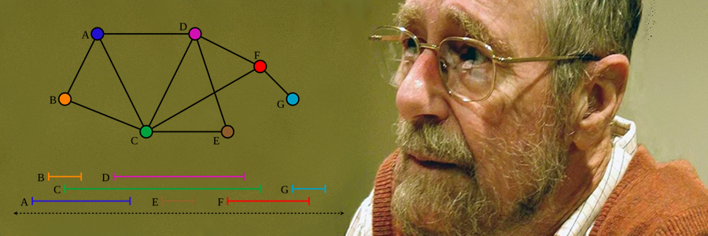

<h1 align="center"> FelipedelosH </h1>
 
<h4>TikTokVisualDijkstra</h4>

 
:construction: Status of project :construction:
  
**TikTokVisualDijkstra** is an interactive visual application built with **Python** and **Tkinter** that allows you to load graphs from `.json` files and watch a step-by-step execution of the **Dijkstra algorithm**.  
This project is designed for educational purposes, providing a graphical demonstration of how nodes are selected, how distances are updated, and how the shortest path between an origin and a destination is determined.

Based on: https://github.com/felipedelosh/PythonDataStructures/tree/main

## :hammer:Funtions:

- `Function 1`: Allows selecting and loading a graph defined in a JSON file, including nodes with coordinates and weighted edges. 
- `Function 2`: Displays an animation of nodes appearing on screen before starting interaction. 
- `Function 3`: Use the mouse to choose an origin and destination node, with visual highlights. 
- `Function 4`: Step-by-step visualization of node selection and distance updates, including blinking effects on updated nodes. 
- `Function 5`: Highlights the shortest path found between the origin and destination in a distinct color.. 

## :play_or_pause_button:How to execute a project

Double click in "main.py"

## :hammer_and_wrench:Tech.

- Python
- Tkinter
- Json

## :warning:Warning.

- Developed and tested on Windows.

## Autor

| [ Andrés Felipe Hernánez](https://github.com/felipedelosh)|
| :---: |